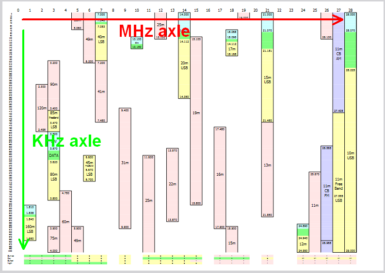

# Short Wave Band Plan for convenient usage with a Wadley Loop Receiver

I created [this Band Plan](ShortWaveBandPlan.pdf) to have a handy handout to tune shortwave stations with my [Century-21](http://www.shortwaveradio.ch/doku.php?id=en:century-21) receiver.

As all other receivers based on the [Wadley loop principle](https://en.wikipedia.org/wiki/Wadley_loop) (most known is probably the [Yaesu FRG-7](http://www.shortwaveradio.ch/doku.php?id=en:frg-7)) it has the tune wheel for the MHz range and the tune wheel for the KHz range inside of the selected MHz range.

My band plan has the MHz ranges as the horizontal axle and the KHz range as the vertical axle, so it is designed to set up the MHz first and then the KHz, as it has to be done on each Wadley loop receiver.

## Bands

The bands are pictured as bars which are horizontally positioned in the MHz range they belong to and vertically spread from they start to they stop frequencies.

The band start/stop frequencies are additionally mentioned at the beginning/end of the bar.

The band are colored to optically differentiate the transmission kind they use:
- Red: [AM](https://en.wikipedia.org/wiki/AM_broadcasting) broadcast
- Yellow: [HAM](https://en.wikipedia.org/wiki/Amateur_radio) broadcast in [LSB or USB](tps://en.wikipedia.org/wiki/Sideband). The concrete type is mentioned under the band name.
- Blue: [CW](http://www.arrl.org/cw-mode) (Morse-Code) broadcast in LSB or USB 
- Green: Data broadcast with different types
- Violet: [CB](https://en.wikipedia.org/wiki/Citizens_band_radio) broadcast 

Some [Freebands](http://www.freebanding.co.uk/echo_charlie.htm) are also mentioned in the plan with they corresponding [calling frequencies](https://ham.stackexchange.com/a/6275)

## Propagation

The bottom of the plan contains the [propagation characteristic](https://m.short-wave.info/index.php?feature=propagation) of the corresponding band during the day (Sunrise/Day/Sunset/Night):
- "+" (Green) : good propagation
- "o" (Yellow) : fair propagation
- "+/-" (Yellow) : changing propagation
- "-" (Red) : bad propagation
